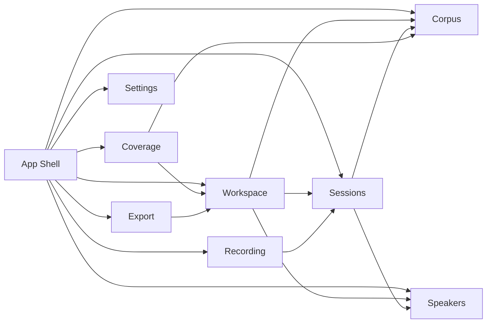

# Architecture Doctrine

Voice Capture Studio exists to produce a canonical, local, engine-independent voice archive. It is not a TTS training tool and it does not depend on Forge. Forge may later consume Voice Capture Studio exports, but dependency must only flow in that direction.

## Non-Negotiable Invariants

1. User voice data never enters the repository.
2. User voice data is never sent to a remote service.
3. The local workspace is the only source of truth for sessions, takes, and progress.
4. The repository owns versioned corpus definitions, scenarios, intentions, language metadata, and application code.
5. Workspaces reference shipped corpus identifiers and versions; user-supplied local corpus snapshots are stored only as explicit input provenance so those sessions can be reopened safely.
6. Domain modules communicate through typed contracts, not through UI components.
7. Capture, coverage, and export engines are ports first, implementations later.

## Dependency Direction

The application shell may import domain modules. Domain modules must not import React, browser UI, routes, or CSS.

## Domain Modules

### Workspace

Owns local persistence contracts, workspace manifest shape, speaker enrollment, session references, and progress snapshots. It is the durable source of truth for what happened locally.

### Corpus

Owns versioned scenario and prompt definitions. Scenario and prompt identifiers are stable. Updates can add prompts and scenarios freely. Renames are allowed only if identifiers stay stable. Removals should leave tombstones or explicit migration metadata.

### Coverage

Owns progress computation contracts. It must compute from workspace progress plus the current corpus manifest. It must not mutate workspace state directly.

### Recording

Owns future recording ports and capture state. It must not decide which prompt should be recorded next.

### Sessions

Owns planned capture sessions and recorded take metadata. A session references corpus prompts by stable identifiers.

### Speakers

Owns seed speaker profiles and supported languages. The default profiles are starter data, not architectural constraints.

### Export

Owns versioned export manifests and artifact contracts. It must be possible to generate `voice.archive`, `voice.dataset`, and `voice.profile` later without changing workspace fundamentals.

### Settings

Owns local preferences only. Settings are not accounts, sync profiles, or remote configuration.

## Challenge To The Vision

GitHub Pages distribution is compatible with local-first usage, but browser storage can be fragile for long-term voice archives. The architecture should therefore prefer the File System Access API where available and treat browser-private storage as a fallback, not the canonical production storage model.

The corpus update strategy also needs explicit tombstones before real corpus evolution starts. Without tombstones, old workspaces could point to prompts that disappear from the shipped corpus. The initial `corpusCompatibilityPolicy` reserves this requirement now.
